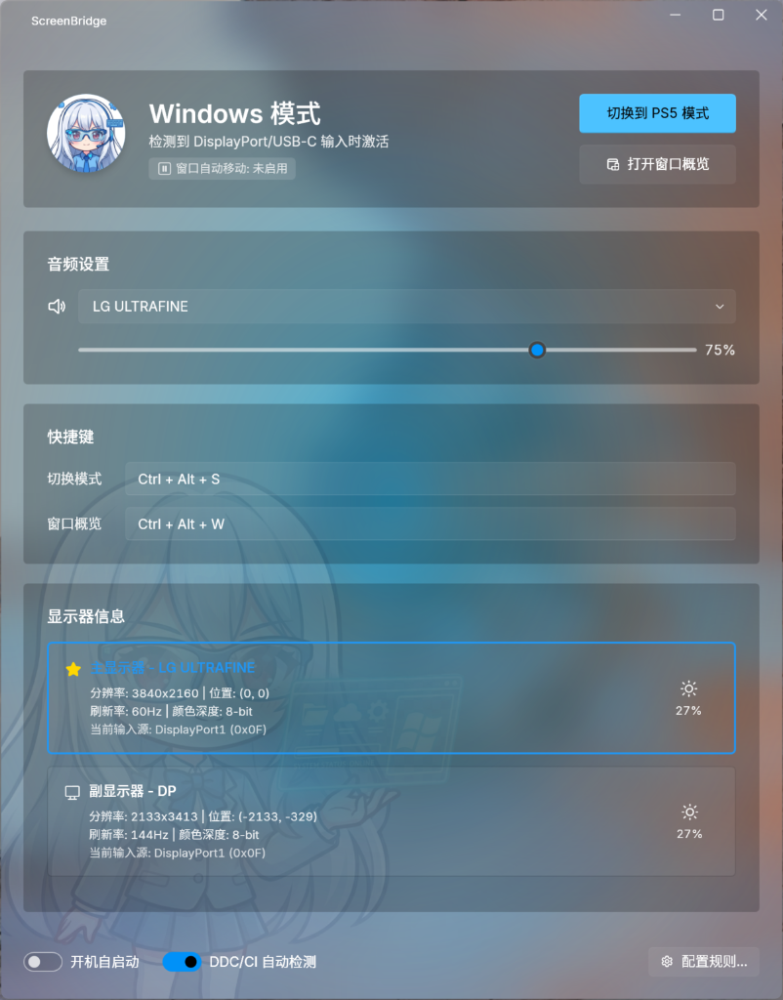
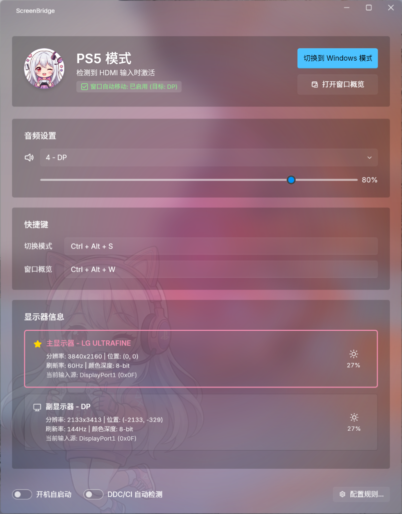

# ScreenBridge 🖥️🎮

> 智能显示器模式切换工具 - 在 PC 和 PS5 之间无缝切换你的显示器设置


<div align="center">
  
  <br/>
  
  
  &nbsp;&nbsp;&nbsp;&nbsp;
  
</div>

ScreenBridge 是一款 Windows 桌面应用程序，专为同时使用 PC 和游戏主机（如 PS5）共享同一显示器的用户设计。它能自动检测显示器输入源变化，并智能切换音频设备、管理窗口位置，让你的多设备工作流程更加顺畅。


## ✨ 核心功能

### 🔄 自动模式切换
- **DDC/CI 自动检测**：通过 DDC/CI 协议实时监控显示器输入源
- **智能触发**：当显示器切换到 HDMI（PS5）或 DP（PC）时自动切换模式
- **兼容模式**：针对 LG 等切源后关闭 DDC 的显示器，支持信号丢失自动切换

### 🔊 音频切换
- 模式切换时自动切换默认音频输出设备
- 支持音量调节
- 实时显示当前活动音频设备

### 🪟 窗口管理
- 新窗口自动移动到指定显示器
- 窗口概览面板，快速查看和管理所有窗口
- 支持将窗口移动到任意显示器
- 智能过滤系统窗口（任务栏、桌面等）

### 💻 桌面集成
- **系统托盘**：最小化到托盘，右键快速切换模式
- **动态图标**：任务栏和托盘图标随模式自动变化（💻 Windows / 🎮 PS5）
- **Toast 通知**：模式切换时发送系统通知提醒
- **高分屏适配**：完美支持 4K 及高 DPI 缩放

### ⌨️ 全局热键
- `Ctrl + Alt + S`：快速切换模式
- `Ctrl + Alt + W`：打开窗口概览
- *(可在设置中自定义热键)*

## 📸 截图 (Screenshots)

<div align="center">
  
  <p><b>Windows 模式 (蓝)</b> - 经典工作模式，搭配冷静的看板娘与呼吸光效</p>
  <br/>
  
  <p><b>PS5 模式 (粉)</b> - 沉浸式游戏体验，粉色主题激萌出击 🎮✨</p>
</div>

## ✨ v1.2 新特性 (Updates)

### 🎨 萌化体验 (Moe & Interactive)
- **看板娘系统**: 引入了动态看板娘 (Mascot) 系统，支持 **Windows (蓝)** 和 **PS5 (粉)** 两种形态。
- **互动对话**: 点击左上角头像，看板娘会根据当前模式和您进行有趣的语音互动。
- **极简 classic**: 严格的经典模式支持，一键关闭所有二次元元素，回归纯净的 Windows 原生体验。
- **视觉升级**: 全新的全局渐变呼吸背景光，以及丝滑的模式切换动画。

### 📑 窗口概览 (Overview 2.0)
- **主题同步**: 窗口概览现在会完美继承主界面的主题风格（黑透/白透）。
- **智能布局**: 自动识别主副显示器，支持拖拽和按钮快速移动窗口。
- **无缝体验**: 在概览中也可以看到看板娘（仅限萌系模式）。

### 🛠️ 体验优化
- **音频选择器**: 主界面新增实时音频设备下拉列表，切换更直观。
- **显示器详情**: 新增刷新率 (Hz) 和色深 (8-bit/10-bit) 精确显示。
- **自动修复**: 修复了经典模式下 UI 元素残留的问题。

## 🚀 快速开始

### 系统要求
- Windows 10/11
- .NET 8.0 Runtime
- 支持 DDC/CI 的显示器（用于自动检测功能）

### 安装

1. 从 [Releases](../../releases) 下载最新版本
2. 解压并运行 `ScreenBridge.App.exe`

### 从源码构建

```bash
# 克隆仓库
git clone https://github.com/elietio/ScreenBridge.git
cd ScreenBridge

# 构建项目
dotnet build

# 运行应用
dotnet run --project src/ScreenBridge.App/ScreenBridge.App.csproj
```

## ⚙️ 配置

点击主界面右下角的 **「配置规则...」** 按钮打开配置窗口：

### 检测设置
- 选择要监控的显示器（支持查看当前 VCP 输入源值）
- 开启/关闭 DDC 信号丢失自动切换（兼容 LG 等显示器）

### 模式配置
为每个模式设置：
- **触发条件**：选择触发该模式的输入源（支持动态读取当前显示器 VCP 值）
- **音频设备**：模式激活时切换到指定的音频输出
- **窗口规则**：新窗口自动移动到指定显示器（支持精确选择型号）
- **程序跟随**：ScreenBridge 主窗口跟随模式移动到指定显示器

## 🏗️ 项目结构

```
ScreenBridge/
├── src/
│   ├── ScreenBridge.Core/          # 核心业务逻辑
│   │   ├── Services/
│   │   │   ├── AudioService.cs     # 音频设备管理
│   │   │   ├── DDCService.cs       # DDC/CI 通信
│   │   │   ├── HotkeyService.cs    # 全局热键
│   │   │   ├── MonitorService.cs   # 显示器检测
│   │   │   └── WindowService.cs    # 窗口管理
│   │   ├── AppConfig.cs            # 应用配置
│   │   ├── ModeManager.cs          # 模式管理器
│   │   └── ModeProfile.cs          # 模式配置模型
│   │
│   └── ScreenBridge.App/           # WPF 应用程序
│       ├── MainWindow.xaml(.cs)    # 主窗口
│       ├── RulesWindow.xaml(.cs)   # 规则配置窗口
│       └── WindowOverview.xaml(.cs) # 窗口概览
│
└── README.md
```

## 🔧 技术栈

- **框架**: .NET 8.0 + WPF
- **UI**: [WPF UI](https://github.com/lepoco/wpfui) (Fluent Design)
- **音频**: AudioSwitcher.AudioApi
- **DDC/CI**: Windows dxva2.dll (GetVCPFeatureAndVCPFeatureReply)
- **窗口管理**: Win32 API (SetWinEventHook, SetWindowPos)

## 📝 常见问题

### DDC/CI 不工作？
1. 确保显示器支持并开启了 DDC/CI 功能
2. 检查线缆连接（某些 HDMI 线不支持 DDC）
3. 尝试在显示器 OSD 菜单中查找 DDC/CI 设置

### 切换到 PS5 后无法自动切回？
这是因为某些显示器（如 LG）在切换输入源后会关闭 DDC 通信。请开启「DDC 信号断开时自动切到模式 B」选项。

### 窗口没有自动移动？
1. 确认在规则配置中设置了正确的窗口移动目标
2. 系统进程（资源管理器、任务栏等）会被自动排除
3. 检查是否有多显示器连接

## 🤝 贡献

欢迎提交 Issue 和 Pull Request！

## 🐛 已知问题 (Known Issues)

- **PS5 模式主题色**: 在切换到 PS5 模式时，部分 UI 控件（如按钮、滑块）可能仍保持默认的蓝色强调色，未正确切换为粉色。目前仅复选框 (CheckBox) 能正确响应颜色切换。此问题受限于 UI 库的主题锁定机制，将在未来版本中修复。

## 📄 许可证

MIT License - 详见 [LICENSE](LICENSE) 文件

---

Made with ❤️ for the PC + Console gaming community
